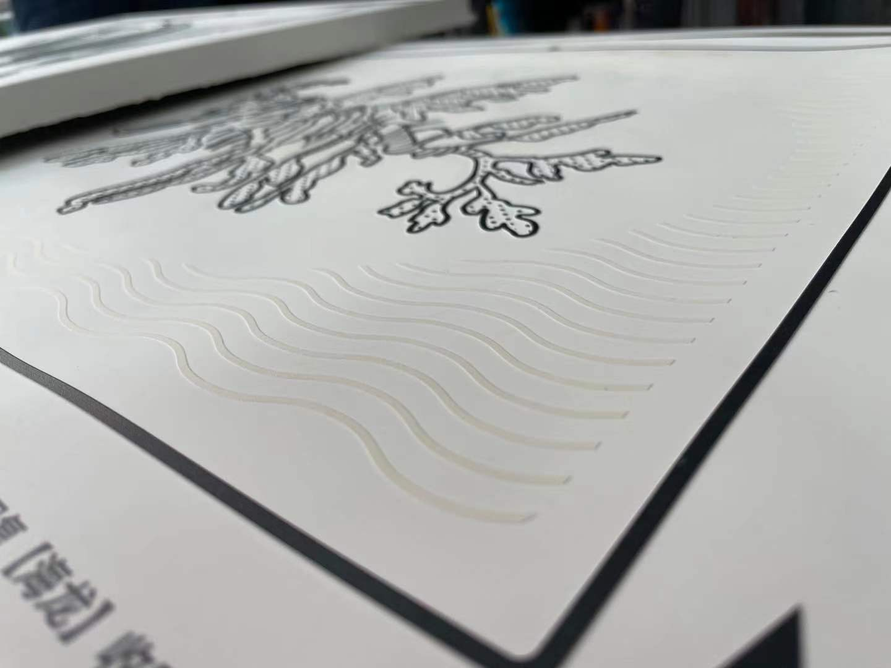

# 看不见的美
Visual Impairment Image

## 起因：

品牌的同学有个案子找到我。几番讨论后想把品牌项目与公益做相对应的结合，也有一起到信息无障碍联盟进行访谈。观察到一个有意思的画，于是有了这个项目。

## 初步想法
1. 已有图像进行多色分流
2. 使用高斯模糊进行杂色涂抹
3. 边缘勾画，凸显主体路径
4. 主题路径生成SVG
5. SVG转3D打印或物理设备平面凸显。
6. 多色分流的图设定设计语言将环境以及特定区域用图案标注。

## 当前实现
1. 使用高斯模糊进行杂色涂抹
2. 边缘勾画，凸显主体路径
3. 主题路径生成SVG